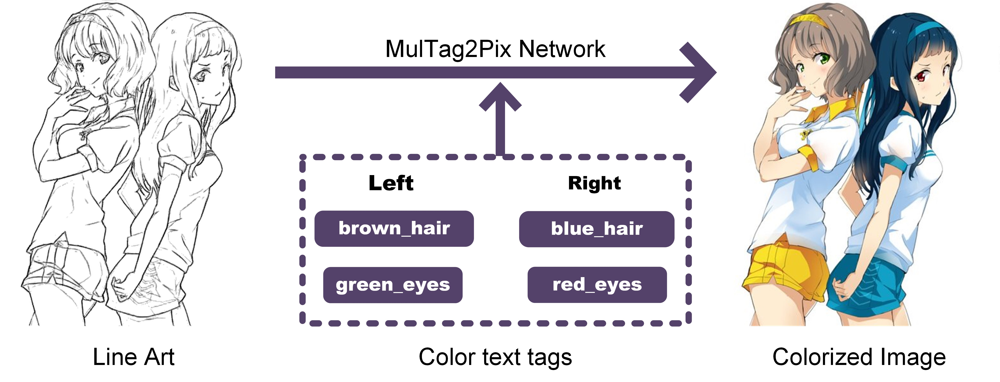

# MulTag2Pix: Tag-adaptive Multi-character Line Art Colorization with Text Tag

**[Title]** MulTag2Pix: Tag-adaptive Multi-character Line Art Colorization with Text Tag.

**[Authors]** Jun Liang, Rui Luo, Nuo Zhou and Hai Su.

**[Abstract]** Line art illustrations often depict multiple characters, yet existing automatic colorization approaches typically focus on single-character line art, leaving a gap in research for multi-character line art colorization. Moreover, automatic colorization methods without user guidance often fail to meet users' personalized needs. To address these issues, we propose MulTag2Pix, a multi-character line art colorization network based on color text tags, which caters to personalized and interactive colorization demands. In addition, existing approaches often fail to adaptively color and coordinate with user-provided color text tags, leading to color errors. Then we innovatively give a Tag-Adaptive Colorization Refinement module (TACR) to handle the challenges. Furthermore, the color bleeding issues severely affect the quality of colorization. Therefore, a dual-branch encoder embedded with skeleton maps is utilized to fuse different sources of information, providing more accurate region segmentation and avoiding inconsistent colors within a given semantic region. Experimental results on a large-scale illustration dataset show that our network achieves high-quality personalized colorization of line art across multiple characters. Furthermore, our network also outperforms state-of-the-art methods in single-character line art colorization.

## Prerequisite
- pytorch == 1.9.0
- torchvision == 0.10.0
- numpy == 1.22.0
- scipy == 1.10.1
- python-opencv == 4.8.0.76
- scikit-image ==0.21.0
- Pillow == 10.0.0
- imageio == 2.31.3
- tqdm == 4.66.1
- keras == 2.13.1
- tensorflow == 2.13.0

## Dataset
We create our dataset based on the Danbooru2020 , which is a large-scale collection of anime-style images. Each illustration contains detailed information on the number of characters, character features (e.g., hair color, eye color), clothing, accessories, and background tags.
### Data selection
**Multi-character data selection.** According to our problem definition, we select some multi-character colored images from the dataset, retaining the corresponding color tags (e.g., blue_eyes, red_hair) and clothing and accessory tags (e.g., hat, skirt, bow).We focus on selecting images with two or more characters in a simple background, ensuring the dataset tags include multiple character hair colors and eye colors in the text tags. It is worth mentioning that our dataset does not discard images with inconsistent numbers of characters, eye colors or hair text tags. For example, when there are two characters in the image but only one eye color text tag (such as black_eyes), we default both characters' eye colors to be the same, both black. This is widely present in the real world, so we retained it. Ultimately, we extract 10,155 multi-character high-definition anime images for training and 2,916 images for testing.

**Single-character data selection.** To improve the detail and quality of coloring each character in multi-character line art, we also select 8,847 single-character color images with simple backgrounds from the dataset, each with complete corresponding tag information. Among them, 6,200 images are used for training, and the rest are used for testing. Additionally, we use lbpcascade_animeface to crop clear facial and hair contours from single-character colored images, totaling 941 images for training.
All images used in our study are 512×512 in size. Since many images in the dataset have black or white borders, we remove the borders from the selected images by mirror padding.

The tag files of the training set and test set we used have been given. You can find pictures consistent with the data set we use through the unique ID number of the picture. Of course, you can also filter the data yourself according to your needs. Then make your own data set by extracting line drawings and generating skeleton maps based on preprocessing.

## Training 

```
python main.py --epoch=300 --input_size=512 --batch_size=4 --model=convnet_dev_skeleton_Adain --cit_cvt_weight 40 50 10 --two_step_epoch=10 --brightness_epoch=24 --save_all_epoch=24  --tag_txt='tags_single.txt'
```

## Test
```
python main.py --test --thread=1 --batch=8 --convnet_dev_skeleton_Adain  --data_dir=testset --input_size=512
```
Saved images will be placed in results/convnet_dev_skeleton_Adain.


